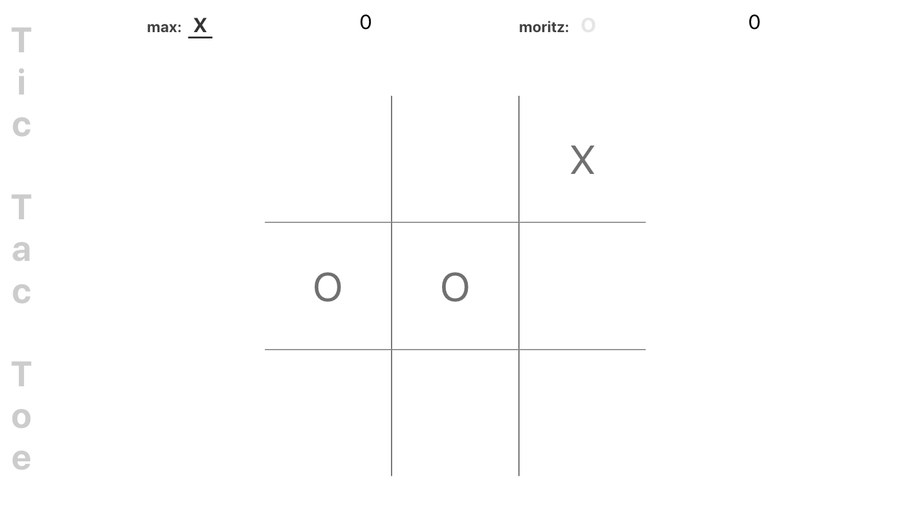

# Tic tac toe

## Setup

This is a React project. Make sure you have node installed.

To install all dependecies run `npm install`.

## Run locally

To run the project locally run npm start.

You can then open the project on [http://localhost:3000](http://localhost:3000) in the browser.

## Build the project

To build the project: `npm run build`.

Builds the app for production to the `build` folder.
